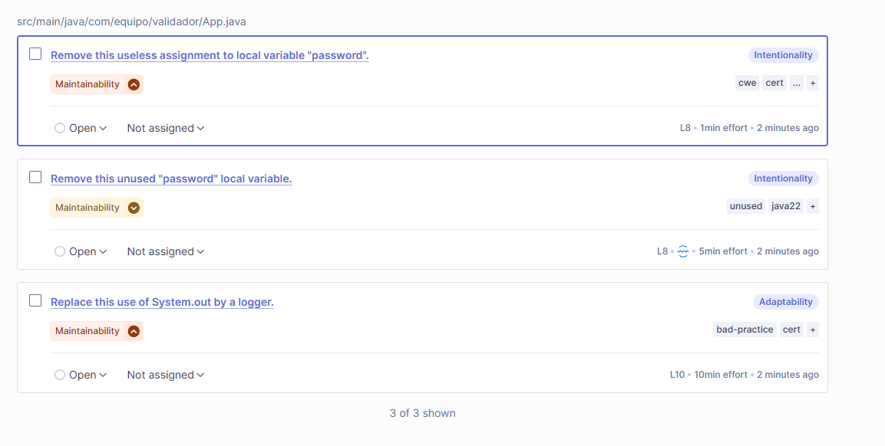

Ejercicio Guiado: Análisis Estático de Código con SonarQube y Maven.
Grupo 2 - Participante : Guillermo Torres / Francisco Leiva. 

Preguntas finales 
- ¿Qué tipo de errores detectó SonarQube que podrían haber pasado desarpercibidos?
  Detecto errores en asignación innecesaria de variables locales, variables no utilizadas y el uso de malas prácticas de seguridad como el hardcoding de credenciales.
  
- ¿Qué ventajas tiene el análisis estático respecto al dinámico?
  Puede detectar errores en una fase temprana , detecta problemas de diseño o malas practicas y encuentra vulnerabilidades antes de que el código llegue a producción.
  
- ¿Cómo impacta SonarQube en la calidad del software antes del despliegue?
  Tiene un impacto significativo en la calidad de software antes del despligue realizando la tarea de identificar y ayudar a corregir problemas tempranamente.
  
- ¿Qué políticas o reglas personalizarías según el tipo de proyecto?
  1.- Reglas de Seguridad (Evitar hardcoding de credenciales - Validar entradas externas)
  2.- Manejo de errores (Reemplazar System.out).
  
### Primer Dashboard

### Segundo Dashboard - Después de corrección

## Issues detectados

### Primeros Issues

### Detalle de un Issue

### Últimos Issues - Despúes de corrección

